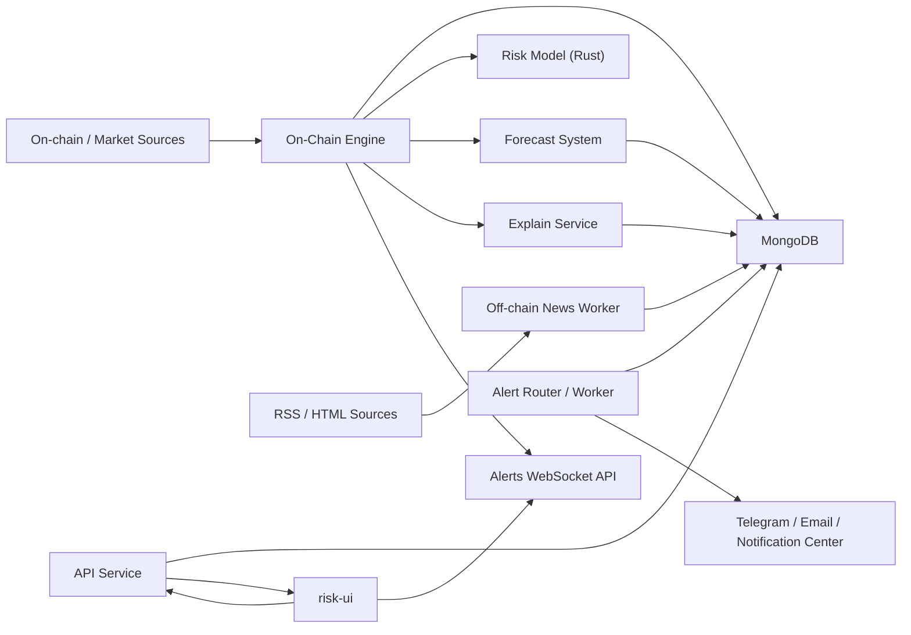
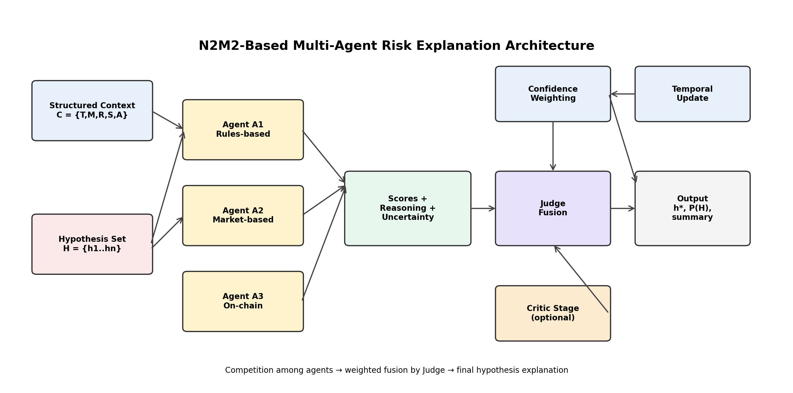
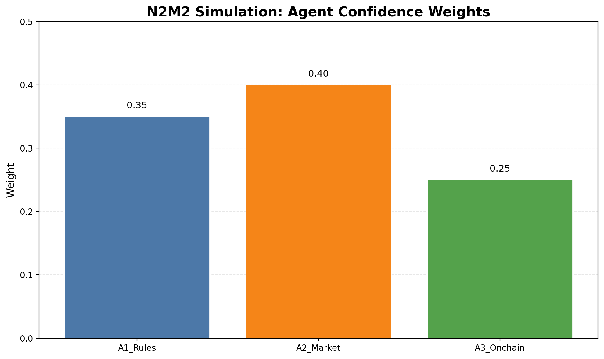
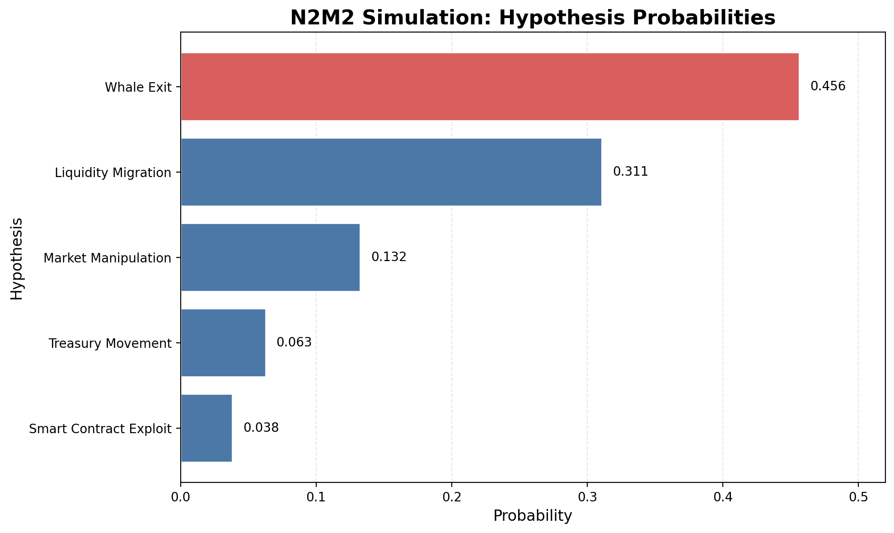

# DeFi Risk Engine Grant Repository

Curated public snapshot of the internal `defi-risk-engine` monorepo prepared for Uniswap and Balancer grant submissions.

This version preserves the main structure and module `README.md` files, but only opens the protocol-facing monitoring core that is useful for grant review. The public boundary is documented in [PUBLIC_SCOPE.md](./PUBLIC_SCOPE.md).

Highlighted public areas:

- `src/onchain_data/`: monitoring engine core, collectors, config handling, explain dispatch logic
- `src/strategies/`: transaction-driven escalation and risk contribution layer
- `src/risk_model/`: Rust base risk model
- `src/config_builder/`: protocol onboarding/config generation
- `docs/grants/`: Uniswap and Balancer grant drafts plus evidence appendix

The original system README from the source repository is preserved below for architectural context.

---

# DeFi Risk Engine

Technical documentation for the `defi-risk-engine` repository.

This `README.md` now serves as the single root-level system document and aggregates information from the existing module-level `README.md` files without changing those module documents themselves.

## What This System Is

`defi-risk-engine` is a monitoring and risk-explanation platform for DeFi protocols. It consists of several independent runtime services that together do the following:

- collect on-chain and market data for protocols
- calculate base risk and transaction-driven pressure
- build snapshot and chart payloads for the UI
- generate AI explanations for state and events
- publish alerts and realtime websocket updates
- expose dashboard-friendly APIs for the frontend

## Main Runtime Parts

| Service | Path | Role |
| --- | --- | --- |
| API service | `api/` | Auth, dashboard/bootstrap API, watchlist, alerts, websocket token issuance |
| On-chain engine | `src/onchain_data/` | Main ingestion runtime, snapshots, tx events, charts, audit hydration |
| Explain service | `src/explain_service/` | Durable explain jobs and provider ensemble |
| Alert system | `src/alert_system/` | Router/worker delivery pipeline via Redis Streams |
| Forecast system | `src/forecast_system/` | Chronos-based short-horizon forecasting |
| Risk model | `src/risk_model/` | Rust scoring service for base risk |
| Off-chain news worker | `src/offchain_data/` | RSS/Atom ingestion for `protocol_news` |

## System Architecture



## Main Data Flow

1. `src/onchain_data/index.js` starts the engine, connects to MongoDB, and syncs the protocol catalog.
2. Collectors gather TVL, whale, tx behavior, token health, candles, and historical bootstrap data.
3. The engine computes derived metrics and calls the Rust risk model.
4. The engine obtains forecasts from the forecast service and stores precomputed chart artifacts.
5. The engine writes `protocolsnapshots`, `tx_risk_events`, `protocolchartpayloads`, and `marketcandles`.
6. The engine sends explain requests to `src/explain_service/` when needed.
7. The off-chain news worker writes `protocol_news`.
8. The alert router/worker reads events, routes delivery jobs, and writes user notifications.
9. `api/` reads MongoDB and serves user-scoped payloads to `risk-ui`.
10. The frontend gets a websocket token through `POST /api/ws/token` and connects to the alert socket.

## Repository Landscape

### Core Runtime

- `src/onchain_data/`
  Main engine runtime.
- `src/explain_service/`
  Explain jobs, provider orchestration, and fusion.
- `src/alert_system/`
  Router/worker alerts pipeline.
- `src/forecast_system/`
  Node orchestration for Chronos forecasting.
- `src/risk_model/`
  Rust scoring service.
- `src/offchain_data/`
  Off-chain protocol news ingestion.

### Shared Contracts And Persistence

- `src/db/`
  Mongo connection, schemas, repositories.
- `src/bootstrap/`
  Startup helpers and initial catalog sync.
- `src/strategies/`
  Transaction-driven risk adjustment.
- `src/config_builder/`
  Generator for `src/onchain_data/config/protocols.json`.

### User-Facing Delivery

- `api/`
  Authenticated backend for the dashboard.
- `risk-ui/`
  Frontend application.

### Historical / Legacy Layers

- `src/routers/`
  Express-era routers.
- `src/services/`
  Express-era service helpers.
- `src/modules/`
  Shared domain helpers between the legacy layer and the newer `api/src/modules/`.

## On-Chain Engine

Source: `src/onchain_data/README.md`

### Purpose

`src/onchain_data/` is the central runtime of the entire platform. It is responsible for:

- orchestrating protocol collectors
- persisting snapshots and tx risk events
- triggering explain flows
- hydrating forecast data
- exposing the alerts websocket used by the frontend

### Bootstrap Sequence

`src/onchain_data/index.js` starts the engine in this order:

1. connect to MongoDB
2. sync protocol metadata from `config/protocols.json`
3. hydrate stored ABI and contract-audit intelligence
4. start the alerts websocket API
5. bootstrap missing snapshots
6. bootstrap scheduled explain requests
7. start transaction monitoring
8. start the model explanation loop
9. start periodic collector loops
10. asynchronously refresh contract audits

### `index.js` Runtime Stack

The on-chain engine is orchestrated by [`src/onchain_data/index.js`](/Users/pc/Desktop/github/defi-risk-engine-grants-public/src/onchain_data/index.js).

Startup stack:

```text
loadProtocolsConfig
  -> buildProtocolRuntimeEntries
  -> main
     -> MongoConnection.connect
     -> syncRuntimeIndexes
     -> initProtocolsFromConfig
     -> hydrateProtocolEntriesWithAbi
     -> hydrateProtocolEntriesWithStoredAudits
     -> alertsApi.start
     -> bootstrapMissingSnapshots
     -> startExplainRequestScheduler
     -> startProtocolRiskExplanationLoop
     -> startCollectorsLoop
     -> bootstrapProtocolContractAudits
```

Collector tick stack:

```text
startCollectorsLoop.tick
  -> runWithConcurrency(protocolRuntimeEntries)
     -> runCollectorsForProtocol(entry)
        -> collectSnapshot
           -> setupCollectors
           -> runCollectorWithSharedCache
           -> ProtocolSnapshotBuilder.build
           -> hydrateCollectorsFromLatestSnapshot
        -> calculateDerived
        -> runInference
        -> buildCombinedRisk
        -> requestForecast
        -> ProtocolSnapshotRepository.save
        -> precomputeProtocolChartPayload
        -> buildRiskAlertPayload / dispatchExplainJob
```

### Runtime Scope Model

The execution unit inside `index.js` is `protocol + network`, not just `protocol`.

- `protocolCatalogEntries`
  protocols loaded from `protocols.json`
- `protocolRuntimeEntries`
  network-expanded runtime scopes produced by `resolveProtocolNetworks()`
- one collector tick
  writes one `ProtocolSnapshot` and one precomputed chart payload per runtime scope

This is the important split:

- risk, TVL, FDV, derived metrics, and forecast are network-scoped
- price candles remain protocol-global market data
- some legacy collectors remain protocol-global and are reused through the shared collector cache
- the API layer merges global and scoped data differently depending on chart type

### Main Responsibilities

- collect protocol state from on-chain and market data sources
- compute derived metrics used by the risk model
- call the Rust risk model service
- request short-horizon forecasts from the forecast service
- persist `protocolsnapshots`, `tx_risk_events`, and chart payloads
- dispatch explain requests to `explain-service`
- publish websocket alert events

### Key Components

- `src/onchain_data/collectors/`
  `TVLCollector`, `WhaleCollector`, `TxBehaviourCollector`, `TokenRiskProfileCollector`, `CandleCollector`, `HistoricalBootstrapCollector`
- `src/onchain_data/explain/`
  explain rule matching, context construction, dispatch
- `src/onchain_data/chartHelpers/`
  precomputed payload generation for dashboard charts
- `src/onchain_data/audit/`
  contract capability audit and ABI hydration
- `src/onchain_data/base/`
  collector base abstractions and websocket helpers

## Strategy-Adjusted Risk

Source: `src/strategies/README.md`

After the base model score, the system adds a transaction-driven contribution.

Formula used by the strategy layer:

`R_total = clamp01(R_base + Delta_tx)`

Where:

- `R_base` comes from the Rust risk model
- `Delta_tx` is computed from recent transaction events
- severity is normalized relative to amount vs. FDV
- time decay and saturation are then applied over a recent window

Illustration:


## Explain Service

Source: `src/explain_service/README.md`

### What It Does

`src/explain_service/` does not calculate risk itself. It turns already-normalized risk context into durable explanation jobs:

- accept explain requests
- persist `explain_jobs`
- run several LLM-backed providers in parallel
- normalize outputs into a fixed-width hypothesis vector
- fuse successful provider outputs
- expose the result through a small HTTP API

### Main Use Cases

- daily protocol refresh explanations
- event-triggered explanations dispatched by the engine
- manual operator or dashboard explain requests

### Providers

The current implementation uses a practical provider ensemble:

- `OpenAIProvider`
- `ClaudeProvider`
- `GeminiProvider`

### Runtime Architecture

- `RequestDeduper`
  cooldown handling, duplicate active jobs, duplicate `event_id`
- `ExplainJobService`
  creates durable explain job payloads and reconstructs context for manual requests
- `ExplainOrchestrator`
  runs enabled providers in parallel and writes job state transitions
- `HypothesisAggregator`
  fuses successful provider outputs into `judge_result`, `final_summary`, and `confidence`

### Explain Service Diagrams

#### Conceptual Architecture



#### Agent Weighting Reference



#### Example Hypothesis Distribution



## Model Explanation Loop

Source: `src/model_explanation/README.md`

This is a separate loop from `explain_service`.

- `model_explanation`
  explains the current model state over a time window
- `explain_service`
  explains a specific event or trigger through provider fusion

### What The Loop Does

For each protocol it:

1. selects a recent time window
2. loads recent `ProtocolSnapshot`
3. loads recent `TxRiskEvent`
4. builds a prompt payload
5. requests a concise explanation
6. persists the result into `protocol_risk_explanations`

### Outputs

- `risk_score`
- `summary`
- `why_now`
- `key_drivers`
- `confidence`
- `window_start`
- `window_end`
- `snapshot_at`

## API Service

Sources: `api/README.md`, `api/src/modules/README.md`, `api/src/modules/dashboard/README.md`, `api/src/modules/alerts/README.md`, `api/src/modules/ws/README.md`

### Purpose

`api/` is an authenticated Next.js backend that reads data already persisted by engine-side services and exposes UI-friendly contracts.

It is responsible for:

- user authentication and sessions via NextAuth
- user-scoped dashboard/bootstrap responses
- watchlist and alert subscription management
- query access to alerts, news, model explanations, explain jobs, and contract audits
- short-lived websocket token issuance
- health and development utility endpoints

### Main Route Groups

- `api/src/app/api/auth/[...nextauth]/route.ts`
  NextAuth entrypoint
- `api/src/app/api/register/route.ts`
  credentials registration
- `api/src/app/api/me/*`
  authenticated dashboard-facing data APIs
- `api/src/app/api/monitor/*`
  watchlist and settings flows
- `api/src/app/api/ws/token/route.ts`
  websocket JWT issuance
- `api/src/app/api/telegram/*`
  Telegram account linking
- `api/src/app/api/health/*`
  liveness/readiness

### Core Service Modules

- `dashboard`
  builds bootstrap payloads, metrics, precomputed chart payloads, and fallbacks
- `monitor`
  watched protocols and alert subscriptions
- `alerts`
  reads `tx_risk_events` and produces UI-ready alerts
- `news`
  reads `protocol_news`, normalizes aliases, and deduplicates articles
- `model-explanation`
  exposes stored `protocol_risk_explanations`
- `explain`
  lists `explain_jobs` and forwards manual explain requests
- `contract-audit`
  exposes stored audit artifacts
- `subscription`
  resolves plan capabilities and protocol limits
- `ws`
  signs short-lived websocket tokens

### API Module Map

| Module | Responsibility | Main Data / Contract |
| --- | --- | --- |
| `auth` | NextAuth config, providers, JWT/session enrichment | session, JWT, redirect allowlist |
| `users` | user and Telegram-link persistence models | `users`, `telegram_link_tokens` |
| `userContext` | resolve authenticated Mongo user from session | `withUser(...)` boundary |
| `dashboard` | bootstrap payloads, metrics, charts, fallbacks | `protocolsnapshots`, `protocolchartpayloads`, `marketcandles` |
| `monitor` | watchlist, subscriptions, monitor settings | `user_protocols`, `user_alert_protocols`, `user_settings` |
| `alerts` | UI-shaped risk event feed and counters | `tx_risk_events` |
| `news` | normalized news feed for watchlist and protocol pages | `protocol_news` |
| `model-explanation` | recent interval-level model explanations | `protocol_risk_explanations` |
| `explain` | list explain jobs and forward manual explain requests | `explain_jobs`, `EXPLAIN_SERVICE_URL` |
| `contract-audit` | expose stored audit findings and capability maps | `protocol_contract_audits` |
| `subscription` | plan limits and feature flags | plan to capability mapping |
| `plans` | minimal shared plan helper | `plans.ts` |
| `notifications` | in-app notification persistence model | `user_notifications` |
| `protocol` | warm enabled-protocol cache for reads | in-memory protocol cache |
| `candle_chart` | external price-candle fallback loader | CoinGecko candle contract |
| `ws` | websocket JWT issuance | short-lived HS256 token |

### Main Endpoints

#### Bootstrap And Metrics

- `GET /api/me/bootstrap`
- `GET /api/dashboard/bootstrap`
- `GET /api/me/dashboard-metrics`

#### Monitor / Watchlist

- `GET /api/monitor/protocols`
- `GET /api/monitor/me/protocols`
- `POST /api/monitor/me/protocols`
- `DELETE /api/monitor/me/protocols/:protocol`

#### Alerts / News / Explanations

- `GET /api/me/alerts`
- `GET /api/me/alerts/count`
- `GET /api/me/news`
- `GET /api/me/model-explanations`
- `GET /api/me/explain-jobs`
- `POST /api/me/explain-jobs`
- `GET /api/me/contract-audits`

#### Realtime / Ops

- `POST /api/ws/token`
- `GET /api/health`
- `GET /api/strategies`

## Alert System

Source: `src/alert_system/README.md`

`src/alert_system/` is split into two runtime stages:

### Router

- listens to upstream risk and tx event streams
- enriches and filters events
- maps alerts to subscribed users
- enqueues delivery jobs into Redis Streams

### Worker

- consumes jobs from a Redis Streams consumer group
- delivers alerts to channels
- handles retries and DLQ routing

### Why This Split Exists

This removes the `for user -> await deliver` bottleneck and allows delivery to scale horizontally.

### Main Files

- `src/alert_system/alertManager.js`
- `src/alert_system/queue/redisStreamQueue.js`
- `src/alert_system/deliveryWorker.js`
- `src/alert_system/index.js`
- `src/alert_system/worker.js`
- `src/alert_system/telegramLinkBot.js`

## Forecast System

Source: `src/forecast_system/README.md`

`src/forecast_system/` is a standalone Node.js service for short-horizon protocol forecasting.

### Pipeline

1. read protocol snapshots and tx risk events from MongoDB
2. build fixed time buckets (`15m` or `1h`) and store them in `protocol_metrics_ts`
3. send metric series to the local Chronos endpoint (Python adapter)
4. recompute future risk from forecasted metrics
5. store future bars in `predicted_risk_ts`

### Components

- Node orchestrator: `src/forecast_system`
- Python predictor adapter: `src/forecast_system/predictor`

### Metrics Sent To Chronos

- `risk_score`
- `tvl_usd`
- `price_usd`
- `fdv_usd`
- `alerts_count`

## Risk Model

Source: `src/risk_model/README.md`

`src/risk_model/` is a Rust scoring service that turns normalized protocol features into a base risk score.

### Input Features

- `tvl`
- `tvl_delta_1d`
- `tvl_delta_7d`
- `price_delta_1d`
- `price_delta_7d`
- `volume_spike`
- `mcap_tvl_ratio`

### Runtime Modes

- `train`
- `infer`
- `serve`

### HTTP Contract

`POST /score`

Request:

```json
{
  "tvl": 1000000,
  "tvl_delta_1d": 0.01,
  "tvl_delta_7d": -0.03,
  "price_delta_1d": 0.02,
  "price_delta_7d": -0.09,
  "volume_spike": 0.6,
  "mcap_tvl_ratio": 0.2
}
```

Response:

```json
{
  "risk": 0.42
}
```

## Off-Chain Protocol News Worker

Source: `src/offchain_data/README.md`

This worker ingests RSS/Atom feeds and fallback HTML article pages, matches articles to enabled protocols, and persists them into `protocol_news`.

### Responsibilities

- read feeds from `config/protocol_rss_sources.json`
- fall back to parsing article links from HTML pages when feeds are unavailable
- match each article to enabled protocols from MongoDB
- save matched articles to `protocol_news`
- deduplicate by `(protocol, dedupeKey)`

## Database Layer

Source: `src/db/README.md`

`src/db/` is the shared persistence contract between runtime components and the API.

### Main Collections

| Collection | Schema / Role |
| --- | --- |
| `protocols` | protocol registry and metadata |
| `protocolsnapshots` | time-series snapshots |
| `protocolchartpayloads` | precomputed dashboard chart payloads |
| `marketcandles` | price candles |
| `tx_risk_events` | normalized transaction risk events |
| `explain_jobs` | explain-service job state |
| `protocol_risk_explanations` | model explanation loop output |
| `users` | user accounts |
| `user_protocols` | watchlist entries |
| `user_alert_protocols` | alert subscriptions |
| `user_settings` | per-user settings |
| `user_notifications` | in-app notifications |

### Repository Helpers

- `Mongo.js`
- `ProtocolRepository.js`
- `ProtocolSnapshotRepository.js`
- `ProtocolChartPayloadRepository.js`
- `MarketCandleRepository.js`
- `TxRiskEventRepository.js`
- `ExplainJobRepository.js`
- `ProtocolRiskExplanationRepository.js`
- `ProtocolSnapshotBuilder.js`

## Config Builder

Source: `src/config_builder/README.md`

`src/config_builder/` generates protocol config for `src/onchain_data/config/protocols.json`.

### What It Generates

- `contracts`
- `flaggedMethods`
- `adminMethods`
- `protocolContracts`
- `whales`
- `owners`
- `whaleTransferMin`
- `liquidityShockAmount`
- `tvl`
- `whale`
- `token_health`

### Data Sources

- ABI/source: Etherscan-like API, fallback Blockscout
- TVL: DefiLlama
- whales: Ethplorer / CoinGecko / Moralis
- thresholds: CoinGecko + DexScreener liquidity

## Bootstrap And Shared Runtime Helpers

Sources: `src/bootstrap/README.md`, `src/modules/README.md`, `src/services/README.md`, `src/routers/README.md`

### Bootstrap

`src/bootstrap/` contains startup helpers for the initial persistent state before long-running loops begin.

Current main scope:

- `src/bootstrap/initProtocols.js`
  upserts protocol metadata from `src/onchain_data/config/protocols.json` into the `Protocol` collection

### Shared Runtime Modules

`src/modules/` contains small shared domain modules:

- `monitor/`
- `plans/`
- `userContext/`

### Legacy Layers

- `src/services/`
  legacy Express-era service helpers
- `src/routers/`
  earlier Express router layer with `monitorRoutes.js`

New product-facing endpoints should go through `api/src/app/api/` and `api/src/modules/`.

## Frontend Integration

The root frontend package in this repository is `risk-ui/`.

The main runtime contract between `risk-ui` and the backend looks like this:

- frontend calls `GET /api/me/bootstrap`
- focused reads go through `alerts`, `news`, `dashboard-metrics`, `model-explanations`, and `contract-audits`
- realtime auth goes through `POST /api/ws/token`
- websocket connection is established against the engine-side alerts socket

### `risk-ui` Runtime Surface

Although `risk-ui` currently does not have a dedicated root `README`, the project structure and deployment docs make the frontend scope clear:

- App Router application with authenticated dashboard flows
- protocol selector, metrics cards, charting, alerts, reasoning, audit, and news views
- consumption of `api/` bootstrap endpoints and engine websocket updates
- deployment via `Dockerfile.risk-ui` and `deploy/k8s/risk-ui`

### Frontend Deploy Notes

Source: `deploy/k8s/risk-ui/README.md`

- image builds from `Dockerfile.risk-ui`
- public runtime config is passed through `NEXT_PUBLIC_API_BASE_URL` and `NEXT_PUBLIC_ALERTS_WS_URL`
- ingress is configured for the application domain in `deploy/k8s/risk-ui/ingress.yaml`

## Realtime WebSocket Flow

Sources: `api/README.md`, `api/src/modules/ws/README.md`, `src/onchain_data/README.md`

1. frontend calls `POST /api/ws/token`
2. API signs a short-lived HS256 JWT
3. frontend connects to the alerts websocket with `?token=...`
4. the engine-side websocket server validates the token and streams updates

## Environment Variables

### Engine

- `MONGODB_URI`
- `MONGODB_DB`
- `ALCHEMY_WS_URL`
- `COINGECKO_KEY`
- `RISK_MODEL_URL`
- `FORECAST_URL`
- `EXPLAIN_SERVICE_URL`
- `WS_TOKEN_SECRET` or `AUTH_SECRET`
- `PROTOCOLS_CONFIG_PATH`
  optional runtime override for `protocols.json`; container builds default to `/app/config/protocols.json`

### API

- `MONGODB_URI`
- `AUTH_SECRET`
- `EXPLAIN_SERVICE_URL`
- `GOOGLE_CLIENT_ID`
- `GOOGLE_CLIENT_SECRET`
- `WS_TOKEN_SECRET`
- `NEXTAUTH_URL`
- `AUTH_ALLOWED_REDIRECT_ORIGINS`
- `CORS_ALLOWED_ORIGINS`
- `PROTOCOLS_CONFIG_PATH`
  optional runtime override for `protocols.json`; container builds default to `/app/config/protocols.json`

### Alert System

- `ALERT_QUEUE_REDIS_URL`
- `ALERT_QUEUE_STREAM`
- `ALERT_QUEUE_GROUP`
- `ALERT_QUEUE_DLQ_STREAM`
- `ALERT_MANAGER_TX_WS_URL`
- `ALERT_MANAGER_RISK_WS_URL`
- `TELEGRAM_BOT_TOKEN`
- `SMTP_HOST`

### Forecast System

- `CHRONOS_ENDPOINT_URL`
- `FORECAST_PORT`
- `FORECAST_DEFAULT_INTERVAL`
- `FORECAST_DEFAULT_HORIZON`

### Explain Service

- `OPENAI_API_KEY`
- `ANTHROPIC_API_KEY`
- `GEMINI_API_KEY`

## How To Run Locally

### 1. API Service

```bash
cd api
npm install
npm run dev
```

### 2. On-Chain Engine

From the repository root:

```bash
npm install
node src/onchain_data/index.js
```

### 3. Explain Service

From the repository root:

```bash
npm install
npm run explain:service
```

### 4. Forecast Service

Python predictor:

```bash
cd src/forecast_system/predictor
python3 -m venv .venv
source .venv/bin/activate
pip install -r requirements.txt
uvicorn app:app --host 0.0.0.0 --port 8000
```

Node service:

```bash
cd /Users/pc/Desktop/github/defi-risk-engine-grants-public
npm run forecast:service
```

### 5. Alert Router / Worker

```bash
npm run alerts:router
npm run alerts:worker
npm run alerts:tg-link-bot
```

### 6. Off-Chain News Worker

```bash
npm run offchain:news
```

## Deploy / Kubernetes

Source: `deploy/k8s/README.md`

Kubernetes manifests are split by service:

- `deploy/k8s/alert-system`
- `deploy/k8s/risk-model`
- `deploy/k8s/onchain-engine`
- `deploy/k8s/offchain-news`
- `deploy/k8s/chronos`
- `deploy/k8s/forecast-service`
- `deploy/k8s/api`
- `deploy/k8s/risk-ui`

Deploy example:

```bash
kubectl apply -k deploy/k8s/risk-model
kubectl apply -k deploy/k8s/chronos
kubectl apply -k deploy/k8s/forecast-service
kubectl apply -k deploy/k8s/onchain-engine
kubectl apply -k deploy/k8s/offchain-news
kubectl apply -k deploy/k8s/alert-system
kubectl apply -k deploy/k8s/api
kubectl apply -k deploy/k8s/risk-ui
```

## Failure Modes And Operational Notes

The module-level documentation implies the following important operational realities:

- if MongoDB is unavailable, the engine will not start
- if the risk model is unavailable, snapshots may still be collected, but scoring degrades
- if the forecast service is unavailable, snapshot persistence may continue without enriched future bars
- external market providers may return partial collector results
- explain dispatch and contract audit are best-effort side flows
- alert delivery operates with at-least-once semantics

## Source README Index

Below is the list of source README files from which this master document was assembled.

### Core Runtime

- `README.md`
- `src/onchain_data/README.md`
- `src/explain_service/README.md`
- `src/alert_system/README.md`
- `src/model_explanation/README.md`
- `src/offchain_data/README.md`
- `src/forecast_system/README.md`
- `src/forecast_system/predictor/README.md`
- `src/risk_model/README.md`

### Persistence And Shared Layers

- `src/db/README.md`
- `src/bootstrap/README.md`
- `src/config_builder/README.md`
- `src/strategies/README.md`
- `src/modules/README.md`
- `src/services/README.md`
- `src/routers/README.md`
- `src/onchain_data/audit/README.md`

### API Layer

- `api/README.md`
- `api/src/modules/README.md`
- `api/src/modules/dashboard/README.md`
- `api/src/modules/alerts/README.md`
- `api/src/modules/auth/README.md`
- `api/src/modules/users/README.md`
- `api/src/modules/ws/README.md`
- `api/src/modules/model-explanation/README.md`
- `api/src/modules/notifications/README.md`
- `api/src/modules/candle_chart/README.md`
- `api/src/modules/explain/README.md`
- `api/src/modules/monitor/README.md`
- `api/src/modules/news/README.md`
- `api/src/modules/contract-audit/README.md`
- `api/src/modules/subscription/README.md`
- `api/src/modules/plans/README.md`
- `api/src/modules/userContext/README.md`
- `api/src/modules/protocol/README.md`

### Deploy And Utilities

- `deploy/k8s/README.md`
- `deploy/k8s/onchain-engine/README.md`
- `deploy/k8s/risk-ui/README.md`
- `deploy/k8s/risk-model/README.md`
- `deploy/k8s/api/README.md`
- `deploy/k8s/alert-system/README.md`
- `deploy/k8s/chronos/README.md`
- `deploy/k8s/offchain-news/README.md`
- `deploy/k8s/forecast-service/README.md`
- `deploy/k8s/explain-service/README.md`
- `scripts/sandbox/README.md`

### Third-Party Asset Notes

The repository also contains vendor `README.md` files inside bundled font assets:

- `risk-ui/fonts/Archivo_Complete/Fonts/WEB/README.md`
- `risk-ui/fonts/Roundo_Complete/Fonts/WEB/README.md`
- `risk-ui/fonts/Satoshi_Complete/Fonts/WEB/README.md`

They relate to bundled font assets rather than the product runtime architecture, so they are not broken out as primary modules in this technical overview.

## Practical Rule

Treat this file as the root technical map of the system, and use the local `README.md` files inside modules as the more detailed source of truth for a specific runtime or service boundary.
