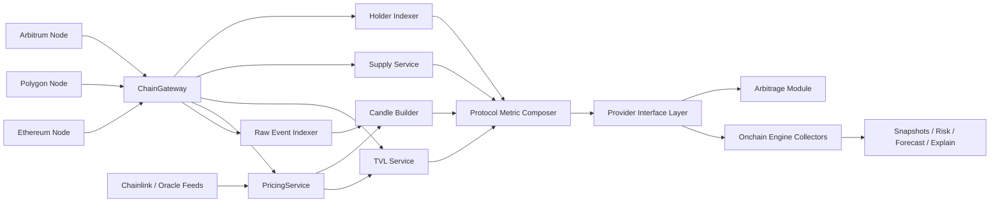

# On-Chain Provider Plane Architecture

Technical design for a future node-backed provider layer that replaces CoinGecko, DefiLlama, and Alchemy behind stable internal interfaces without rewriting the whole risk engine.

## Goal

Build a new provider plane that:

- uses self-hosted nodes for Ethereum, Polygon, and Arbitrum
- computes protocol metrics from on-chain state and events
- preserves the current downstream engine contracts where practical
- allows gradual migration protocol-by-protocol and metric-by-metric
- supports future reuse by the arbitrage module

This document assumes:

- the current `onchain-engine` orchestration remains in place
- collectors, snapshots, risk scoring, forecast, explain, and alerts remain the main downstream consumers
- the new work is concentrated in the upstream data/provider layer

## Current Boundary

Today the engine is provider-driven:

- `TVLCollector` reads protocol TVL from DefiLlama
- `TokenRiskProfileCollector` reads price, FDV, market cap, reserves, and volume from CoinGecko
- `CandleCollector` reads contract price history from CoinGecko
- `TxBehaviourCollector` uses `ALCHEMY_WS_URL` for tx/log monitoring

Relevant files:

- [src/onchain_data/index.js](/Users/pc/Desktop/github/defi-risk-engine-grants-public/src/onchain_data/index.js)
- [src/onchain_data/collectors/TVLCollector.js](/Users/pc/Desktop/github/defi-risk-engine-grants-public/src/onchain_data/collectors/TVLCollector.js)
- [src/onchain_data/collectors/TokenRiskProfileCollector.js](/Users/pc/Desktop/github/defi-risk-engine-grants-public/src/onchain_data/collectors/TokenRiskProfileCollector.js)
- [src/onchain_data/collectors/CandleCollector.js](/Users/pc/Desktop/github/defi-risk-engine-grants-public/src/onchain_data/collectors/CandleCollector.js)
- [src/onchain_data/collectors/TxBehaviourCollector.js](/Users/pc/Desktop/github/defi-risk-engine-grants-public/src/onchain_data/collectors/TxBehaviourCollector.js)
- [src/db/ProtocolSnapshot.js](/Users/pc/Desktop/github/defi-risk-engine-grants-public/src/db/ProtocolSnapshot.js)
- [src/config_builder/ProtocolConfigBuilder.js](/Users/pc/Desktop/github/defi-risk-engine-grants-public/src/config_builder/ProtocolConfigBuilder.js)

## What Stays, What Changes, What Is New

### Keep As-Is

These parts should stay mostly unchanged:

- collector loop orchestration in `src/onchain_data/index.js`
- snapshot persistence contract in Mongo
- risk model interface
- forecast service interface
- explain flow
- tx strategy layer and alert publishing

These are already useful abstractions:

- `BaseCollector`
- `ProtocolSnapshotBuilder`
- `TxRiskEventRepository`
- `ProtocolSnapshotRepository`

### Change

These parts need refactoring, but not a full rewrite:

- collector implementations: switch from external APIs to provider interfaces
- protocol config format: extend from protocol-centric config to network-aware and pool-aware config
- snapshot schema: keep current top-level outputs, but add `network`, `markets`, `sources`, and provider freshness metadata
- dashboard candle loading: swap CoinGecko fallback for internal candle service
- config builder: generate registry records for node-backed adapters instead of CoinGecko/DefiLlama payloads

### Write From Scratch

These modules do not exist in the current codebase and must be implemented from scratch:

- node clients for Ethereum, Polygon, Arbitrum
- provider interface layer
- protocol registry v2
- pool discovery and per-protocol adapters
- pricing/oracle service
- TVL calculation service
- candle/history builder from on-chain events or oracle observations
- supply service for FDV
- holder distribution indexer if whale concentration must be fully self-hosted
- raw event / tx indexing layer with backfill and reorg handling

## Migration Principle

The safe path is not to replace the engine directly. The safe path is:

1. Introduce provider interfaces.
2. Put current CoinGecko / DefiLlama / Alchemy implementations behind those interfaces.
3. Add node-backed implementations behind the same interfaces.
4. Switch protocol-by-protocol.

This keeps the change localized to the provider plane.

## Target Architecture



## Logical Components

### 1. ChainGateway

Unified access layer above JSON-RPC and WebSocket RPC.

Responsibilities:

- `eth_call`
- `eth_getLogs`
- `eth_subscribe`
- multicall batching
- block cursor management
- retry / timeout / rate shaping
- finality / confirmation policy
- reorg-safe read helpers

Suggested interface:

```ts
interface ChainGateway {
  getBlockNumber(network: Network): Promise<number>
  call(network: Network, request: RpcCall): Promise<string>
  multicall(network: Network, calls: RpcCall[]): Promise<string[]>
  getLogs(network: Network, filter: LogFilter): Promise<Log[]>
  subscribeLogs(network: Network, filter: LogFilter, handler: (log: Log) => void): Unsubscribe
  subscribeHeads(network: Network, handler: (block: BlockHeader) => void): Unsubscribe
}
```

### 2. Protocol Registry V2

Current config is protocol-centric. The new registry must be network-aware and market-aware.

Suggested model:

```json
{
  "protocol": "uniswapv3",
  "networks": [
    {
      "network": "ethereum",
      "contracts": [],
      "markets": [
        {
          "market_id": "eth-usdc-500",
          "adapter": "uniswap-v3-pool",
          "address": "0x...",
          "base_token": "0x...",
          "quote_token": "0x..."
        }
      ],
      "pricing": {
        "primary": "chainlink",
        "fallback": "dex_twap"
      }
    }
  ]
}
```

Registry responsibilities:

- protocol to network mapping
- pool/market inventory
- adapter type for each market
- token metadata
- oracle configuration
- tx monitoring targets
- optional manual overrides

### 3. Provider Interface Layer

The provider plane should expose stable internal interfaces.

Suggested interfaces:

```ts
interface ProtocolTvlProvider {
  getProtocolTvlUsd(protocol: string, network?: Network): Promise<ProtocolTvlResult>
}

interface TokenMetricProvider {
  getTokenMetrics(token: Address, network: Network): Promise<TokenMetricResult>
}

interface CandleProvider {
  getCandles(input: CandleRequest): Promise<Candle[]>
}

interface TxProvider {
  subscribeProtocolEvents(input: TxSubscriptionRequest): Promise<SubscriptionHandle>
  backfillProtocolEvents(input: TxBackfillRequest): Promise<TxEvent[]>
}
```

The existing collectors then depend on these internal interfaces instead of external vendors.

## Metric Definitions And Formulas

The provider plane must output the same downstream semantics where possible.

### 1. Price

Preferred hierarchy:

1. Chainlink latest round if feed exists and is fresh
2. DEX TWAP from a configured reference pool
3. Manual override only for unsupported assets

#### Chainlink price

If oracle decimals are `d`:

`price_usd = answer / 10^d`

Freshness rule:

`is_fresh = now - updated_at <= max_staleness_ms`

If not fresh, fallback.

#### DEX TWAP

For a TWAP window `W`:

`price_twap = average(price(t)) over [now - W, now]`

For Uniswap v3 this should use cumulative ticks and derive geometric average price over the window rather than naive spot price.

### 2. FDV

Use:

`fdv_usd = token_price_usd * total_supply`

Where:

- `token_price_usd` comes from `PricingService`
- `total_supply` is read on-chain from `ERC20.totalSupply()`

Notes:

- this is valid for FDV
- this is not the same as circulating market cap

### 3. Market Cap

If circulating supply is available:

`market_cap_usd = token_price_usd * circulating_supply`

If circulating supply is not available, store:

- `market_cap_usd = null`
- or temporary fallback `market_cap_usd = fdv_usd`

Do not silently treat FDV as true circulating market cap in internal source-of-truth logic.

### 4. Pool TVL

Generic pool formula:

`pool_tvl_usd = Σ(balance_i * price_i_usd)`

Where:

- `balance_i` is the actual token balance held by the market/pool/vault
- `price_i_usd` comes from `PricingService`

Protocol TVL:

`protocol_tvl_usd = Σ(pool_tvl_usd across all markets in all selected networks)`

### 5. Liquidity

There is no single universal liquidity formula. It must be adapter-specific.

#### AMM reserve-based liquidity proxy

For a 2-token pool:

`reserves_usd = reserve0 * price0_usd + reserve1 * price1_usd`

This is a useful generalized liquidity proxy and can replace the current `reserves_usd`.

#### Constant product AMM exact output

For swap input `dx` with reserves `x`, `y` and fee-adjusted input `dx'`:

`dy = (dx' * y) / (x + dx')`

Slippage:

`slippage = 1 - execution_price / mid_price`

This should be used only in adapters where exact AMM math is known.

#### Lending market liquidity

Use withdrawable / borrowable liquidity:

`available_liquidity_usd = cash * underlying_price_usd`

Where `cash` is the protocol-specific available underlying.

### 6. Volume 24h

If derived from swaps:

`volume_24h_usd = Σ(abs(trade_value_usd)) over last 24h`

For lending or vault protocols, volume semantics differ. If no meaningful economic volume exists, either:

- use adapter-specific volume semantics, or
- leave `volume_24h_usd = 0` and do not invent synthetic values

### 7. Whale Distribution

If fully self-hosted, compute from indexed balances:

`top10_share = Σ(balance of top 10 holders) / total_supply`

This requires:

- full `Transfer` event indexing
- mint/burn handling
- exclusions policy for dead addresses, treasury, staking wrappers, bridges if needed

This is expensive and should be treated as a later-stage module, not phase 1.

### 8. Derived Features For Current Risk Model

To preserve current model inputs:

`tvl_delta_1d = (tvl_t - tvl_t-1d) / tvl_t-1d`

`tvl_delta_7d = (tvl_t - tvl_t-7d) / tvl_t-7d`

`price_delta_1d = (price_t - price_t-1d) / price_t-1d`

`price_delta_7d = (price_t - price_t-7d) / price_t-7d`

`volume_spike = volume_24h_t / avg(volume_24h over previous 7 buckets)`

`mcap_tvl_ratio = market_cap_usd / tvl_usd`

These match the current downstream assumptions in the engine.

### 9. Transaction USD Amount

For tx risk and future arbitrage signals:

`amount_usd = token_amount * token_price_usd`

Where:

- `token_amount` is normalized by token decimals
- `token_price_usd` is the best available price at event time or nearest fresh price snapshot

## Adapter Strategy

TVL and liquidity are not universal. The provider plane should use adapter families.

### Adapter Families

- `amm-v2`
- `amm-v3`
- `lending-market`
- `vault-erc4626`
- `staking-lsd`
- `restaking-lrt`
- `synthetic-cdp`

Each adapter must define:

- market discovery strategy
- contracts to read
- state calls required
- event types required
- formulas for TVL
- formulas for liquidity
- formulas for price fallback if any

### Adapter Output Contract

Every adapter should return:

```ts
interface MarketMetric {
  protocol: string
  network: string
  market_id: string
  block_number: number
  tvl_usd: number
  reserves_usd?: number
  available_liquidity_usd?: number
  volume_24h_usd?: number
  price_sources: SourceMeta[]
  token_metrics: TokenMetric[]
}
```

The protocol metric composer aggregates these into protocol-level outputs.

## Data Model Changes

### Keep Backward-Compatible Fields

Keep these outputs because downstream already expects them:

- `collectors.TVLCollector.data.tvl_usd`
- `collectors.TokenRiskProfileCollector.data.price.usd`
- `collectors.TokenRiskProfileCollector.data.price.fdv_usd`
- `collectors.TokenRiskProfileCollector.data.price.market_cap_usd`
- `collectors.TokenRiskProfileCollector.data.market_risk.volume_usd_24h`

### Add New Fields

Add these for forward compatibility:

- `snapshot.networks`
- `snapshot.markets`
- `snapshot.sources`
- `snapshot.source_health`
- `snapshot.block_context`

Suggested additions:

```json
{
  "sources": {
    "pricing": "chainlink+dex_twap",
    "tvl": "node_backed",
    "candles": "swap_indexer",
    "tx": "self_hosted_ws"
  },
  "block_context": {
    "ethereum": 123,
    "polygon": 456,
    "arbitrum": 789
  }
}
```

## Module-Level Design

### Reworked Collectors

#### TVLCollector

Replace DefiLlama fetch with:

- load registry markets for protocol
- request per-market state via adapters
- aggregate `protocol_tvl_usd`

#### TokenRiskProfileCollector

Replace CoinGecko fetch with:

- `PricingService`
- `SupplyService`
- optional liquidity computation from configured primary market

Output shape should remain close to current contract.

#### CandleCollector

Replace CoinGecko candle fetch with:

- swap/event index
- reference market price reconstruction
- bucket builder

Keep current candle schema for UI compatibility.

#### TxBehaviourCollector

Replace `ALCHEMY_WS_URL` dependency with:

- self-hosted WS endpoints from `ChainGateway`
- backfill cursor
- confirmation policy
- reorg-safe replay support

This is the highest-ROI early migration because it is structurally closest to existing code.

## Reorg, Freshness, And Reliability Rules

### Finality

Each network should have a confirmation policy:

- Ethereum: `N_eth_confirmations`
- Polygon: `N_polygon_confirmations`
- Arbitrum: `N_arb_confirmations`

Pending stream can still exist for low-latency signals, but persisted business metrics should be based on confirmed state.

### Freshness

Every metric should carry freshness metadata:

- `measured_at`
- `block_number`
- `source`
- `stale`

### Backfill

Indexer components must support:

- initial historical bootstrap
- resume from cursor
- replay after downtime
- idempotent persistence

## Arbitrage Module Reuse

The same provider plane can later serve arbitrage.

Useful shared outputs:

- real-time pool state
- swap event stream
- token prices
- gas pricing
- mempool / pending tx stream

Do not couple arbitrage execution logic to risk-engine collectors. Both should depend on the provider plane, not on each other.

## Implementation Plan

### Phase 0. Preparation

Scope:

- define provider interfaces
- freeze current downstream output contracts
- define registry v2 schema

Change type:

- mostly additive

### Phase 1. Self-Hosted Tx Layer

Scope:

- replace `Alchemy` with self-hosted RPC/WS
- keep existing tx risk logic
- add cursoring and backfill

Change type:

- refactor existing tx provider usage

### Phase 2. Pricing And Supply

Scope:

- build `PricingService`
- build `SupplyService`
- reimplement `TokenRiskProfileCollector`

Change type:

- mixed: partial refactor plus new modules

### Phase 3. TVL And Liquidity For Pilot Adapters

Scope:

- implement 2-3 adapter families
- aggregate protocol TVL from pools/markets
- compute liquidity metrics for pilot protocols

Change type:

- mostly new implementation

### Phase 4. Candle And History Pipeline

Scope:

- build on-chain candle reconstruction
- swap dashboard fallback to internal service

Change type:

- mostly new implementation

### Phase 5. Multi-Chain Rollout

Scope:

- Ethereum, Polygon, Arbitrum rollout
- network-aware cursors
- production hardening

Change type:

- scaleout of prior phases

### Phase 6. Whale Distribution And Advanced Analytics

Scope:

- holder indexing
- concentration distribution
- optional circulating supply policy framework

Change type:

- greenfield

## Estimated Scope

These estimates assume:

- one strong engineer driving the module
- agent-assisted implementation for repetitive codegen, adapter scaffolding, tests, and refactors
- existing downstream services remain mostly unchanged
- no major product scope creep during implementation

### Preparation

- provider interfaces and registry v2 design: `2-3 days`
- migration plan and compatibility wrappers: `2-3 days`

### Phase 1. Self-Hosted Tx Layer

- self-hosted RPC/WS integration: `3-4 days`
- tx backfill, cursoring, replay safety: `3-5 days`
- engine integration and verification: `2-3 days`

Total: `1.5-2 weeks`

### Phase 2. Pricing And Supply

- `PricingService` with Chainlink + DEX fallback: `4-6 days`
- `SupplyService` for ERC20 total supply and normalization: `1-2 days`
- `TokenRiskProfileCollector` migration: `3-4 days`

Total: `1.5-2 weeks`

### Phase 3. TVL And Liquidity For Pilot Adapters

- adapter framework: `3-4 days`
- first adapter family: `3-5 days`
- second adapter family: `3-5 days`
- third adapter family: `3-5 days`
- protocol aggregation and tests: `2-3 days`

Total: `2.5-4 weeks`

### Phase 4. Candle And History Pipeline

- event-driven price history model: `3-4 days`
- bucket builder and persistence: `2-3 days`
- API/dashboard migration: `2-3 days`

Total: `1.5-2 weeks`

### Phase 5. Multi-Chain Rollout

- Ethereum rollout hardening: `2-3 days`
- Polygon rollout: `3-5 days`
- Arbitrum rollout: `3-5 days`
- operational health checks and failover: `2-3 days`

Total: `2-3 weeks`

### Phase 6. Whale Distribution And Advanced Analytics

- holder indexer foundation: `4-6 days`
- distribution computation and exclusions policy: `3-5 days`
- integration into snapshots: `2-3 days`

Total: `1.5-2 weeks`

## Aggregate Timelines

### Minimal Pre-Invest Build

Includes:

- preparation
- self-hosted tx layer
- pricing and supply
- 1-2 pilot adapters

Estimated total:

- `4-6 weeks`

### Production Core Without Full Whale Indexing

Includes:

- preparation
- self-hosted tx layer
- pricing and supply
- TVL/liquidity adapters
- candles
- multi-chain rollout

Estimated total:

- `8-12 weeks`

### Full Provider Plane Including Whale Distribution

Includes everything above plus holder distribution.

Estimated total:

- `10-14 weeks`

## Recommendation

The best future path is:

1. Build provider interfaces first.
2. Land self-hosted tx infrastructure first.
3. Replace price and supply next.
4. Move TVL/liquidity to adapter-based computation for selected protocols.
5. Delay whale distribution until the rest of the provider plane is stable.

This gives the best ROI while preserving the current engine.

## Sources

Infra sizing references used when planning node capacity:

- [Ethereum run-a-node docs](https://ethereum.org/de/developers/docs/nodes-and-clients/run-a-node/)
- [Polygon node prerequisites](https://docs.polygon.technology/pos/how-to/prerequisites/)
- [Arbitrum full node docs](https://docs.arbitrum.io/run-arbitrum-node/run-full-node)
