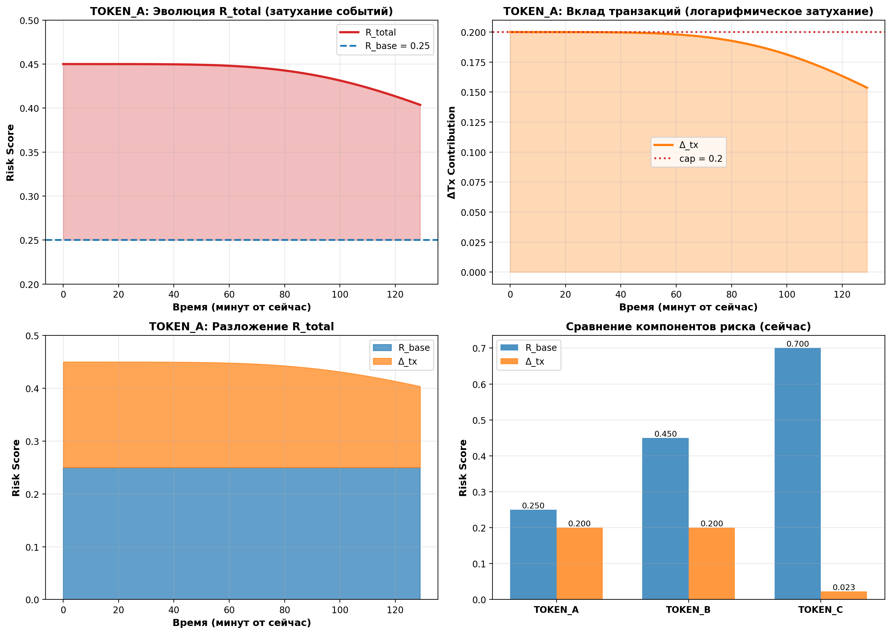

# Strategy-Adjusted Risk Scoring

This module now combines model risk with transaction-driven pressure in four steps.

## 1) Keep base model risk

The model output remains the base score:

`R_base = risk_model_score`, where `R_base in [0, 1]`.

## 2) Add a separate transaction contribution

The final score is a bounded additive blend:

`R_total = clamp01(R_base + Delta_tx)`

Where `Delta_tx` is computed independently from recent strategy-matched transaction events.

## 3) Normalize each event by protocol size (FDV)

For each event `i`, severity is scaled by strategy weight and transfer size relative to FDV:

`severity_i = w_strategy_i * log1p(amount_usd_i / (FDV * k))`

- `w_strategy_i`: weight of matched strategy (configurable)
- `amount_usd_i`: event size in USD (prefer event `amount_usd`, fallback to `amount * price_usd`)
- `FDV`: protocol reference size (FDV, fallback to market cap, then TVL)
- `k`: FDV scaling factor (default `0.001`, i.e. 0.1% reference threshold)

## 4) Apply time decay and saturation over a recent window

Within a recent window (default 1 hour), events are summed with exponential decay:

`Delta_tx_raw = sum_i(severity_i * exp(-age_i / tau))`

Then converted to bounded pressure and bounded delta:

`tx_pressure = 1 - exp(-Delta_tx_raw)`

`Delta_tx = cap * tx_pressure`

- `tau`: decay horizon (default 45 minutes)
- `cap`: maximum additive transaction contribution (default `0.20`)

## Configuration switch

Transaction contribution can be disabled per protocol in `src/onchain_data/config/protocols.json`:

```json
"txRiskContributionEnabled": false
```

When disabled, `R_total = R_base`.

## Threshold units

All strategy thresholds are interpreted as USD amounts:

- `whaleTransferMin` (in `protocols.json`) is USD.
- `liquidityShockAmount` (in `protocols.json`) is USD.

For transfer events, token amounts are converted to USD before threshold checks:

- Preferred: event `amount_usd`
- Fallback: `amount * price_usd`

## Dynamics illustration


